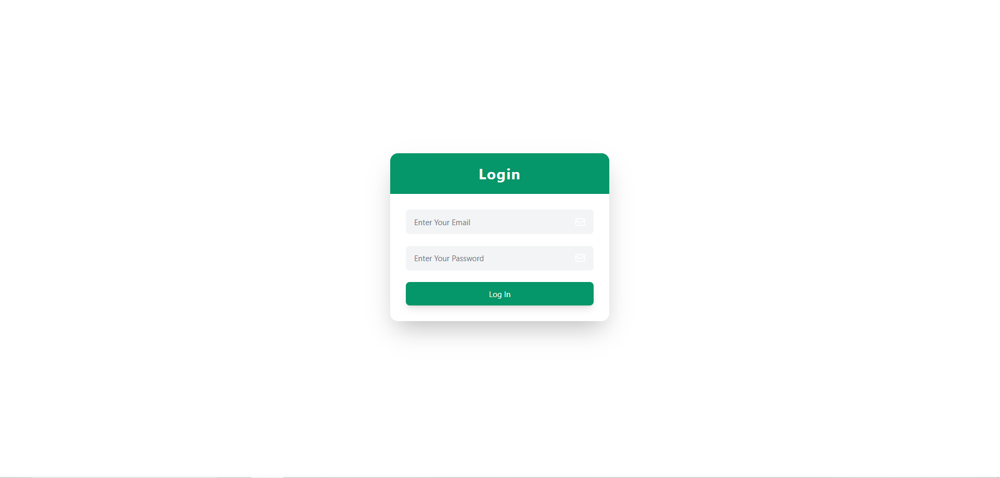
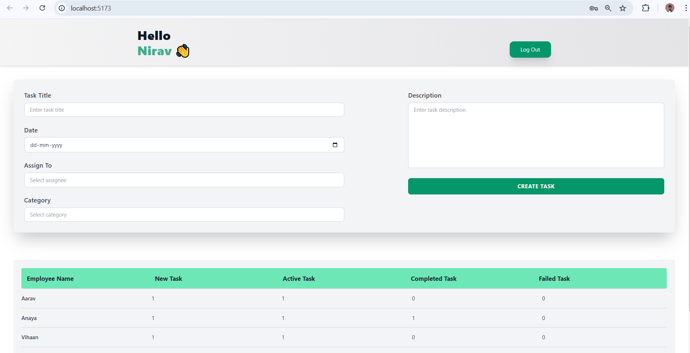
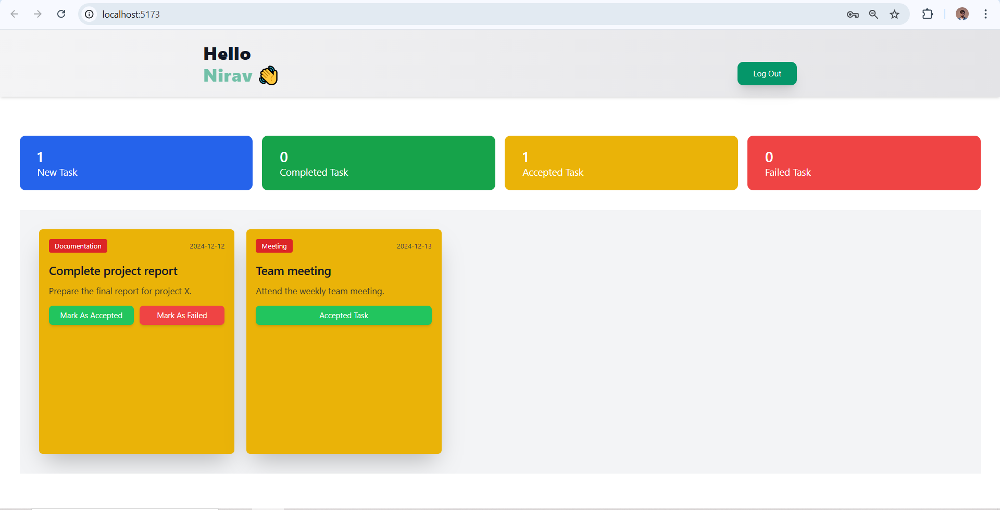

# 🚀 Employee Management System 🌟

A simple and intuitive **Employee Management System** built using **React** and **Vite**!  
This system allows employers to create tasks (with images 🖼️), and employees can accept and manage these tasks efficiently.  
No database required — it's all about simplicity! 😄

---

## ✨ Features

- **Task Creation** 📝: Employers can easily create tasks with descriptions and attach images.  
- **Task Assignment** 👩‍💼👨‍💼: Employees can view available tasks and accept them with a single click.  
- **Interactive UI** 🎨: A clean and responsive interface for seamless task management.  
- **Real-time Updates** 🔄: React's state management ensures everything feels snappy and modern.

---

## 🛠️ Technology Stack

- **Frontend**: [React](https://reactjs.org/) ⚛️ + [Vite](https://vitejs.dev/) ⚡  
- **State Management**: React's built-in hooks 🪝 (like `useState` and `useEffect`)  
- **Styling**: CSS or your favorite library ✨  


---

## 🚀 Getting Started

### 1. Clone the repository  
```bash
git clone https://github.com/your-username/employee-management-system.git
cd employee-management-system
```

### 2. Install dependencies  
```bash
npm install
```

### 3. Start the development server  
```bash
npm run dev
```

### 4. Open in your browser 🌐  
Go to [http://localhost:5173](http://localhost:5173) to see the app in action.

---

## 🤖 How It Works

1. **Employers** create tasks with a title, description, and optional image upload.  
2. **Employees** see a list of available tasks and can choose to accept them.  
3. Tasks update in real-time on the frontend with React's state updates.  

---

## 🎉 Why Use This System?

- **No Complexity**: No databases or servers needed. Perfect for lightweight task management.  
- **Fun & Interactive**: Designed with a simple yet engaging UI.  
- **Modern Tech Stack**: Uses React and Vite for blazing-fast development.  

---

## 📸 Screenshots

### Login Page 🔑


### Admin Dashboard 🖥️


### Employee Dashboard 👩‍💼


---

## 🔧 Customization

Feel free to tweak and improve this system for your specific needs:  
- Add more features like task deadlines ⏳ or priority levels 🚨.  
- Enhance the UI with libraries like Tailwind CSS or Material-UI.  

---

### 📬 Feedback & Contributions

Have ideas or found a bug?  
Open an issue or submit a pull request on [GitHub](https://github.com/your-username/employee-management-system).  

---

👨‍💻 Happy Coding! 💻✨
